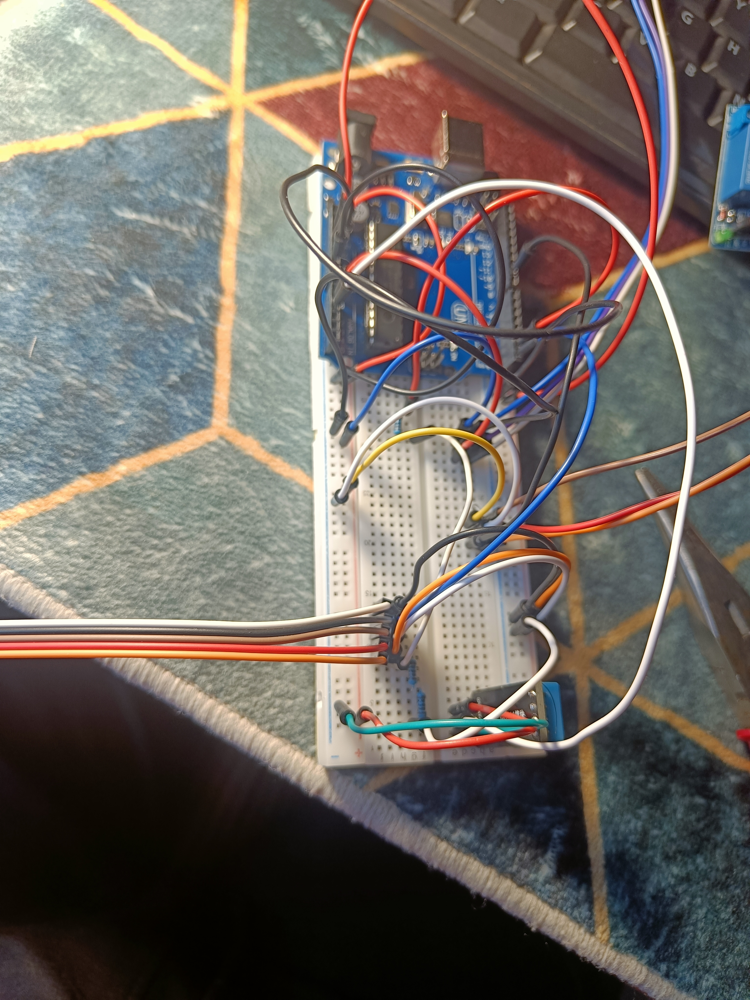
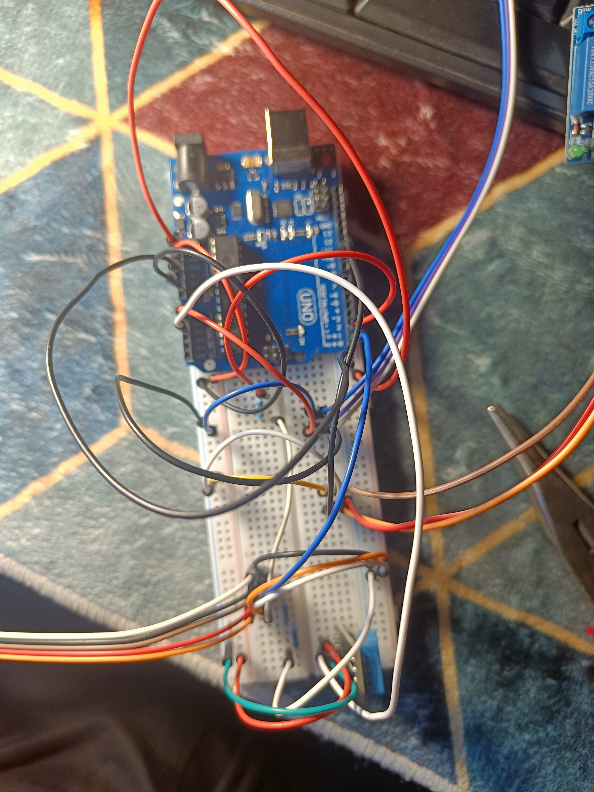
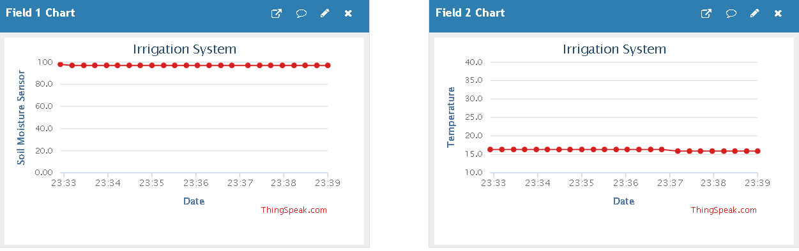
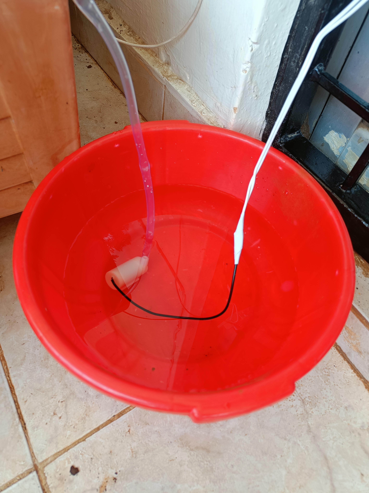
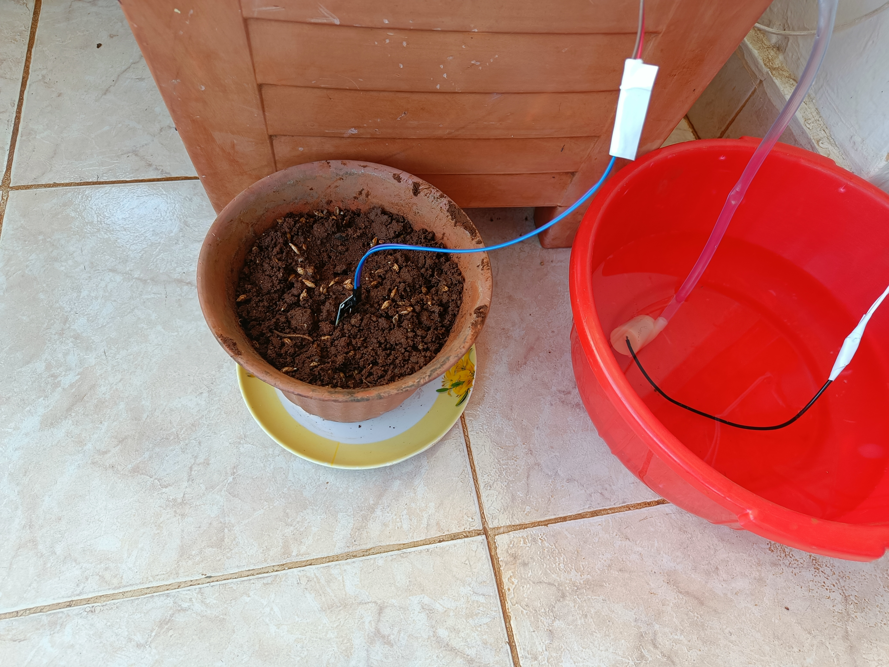
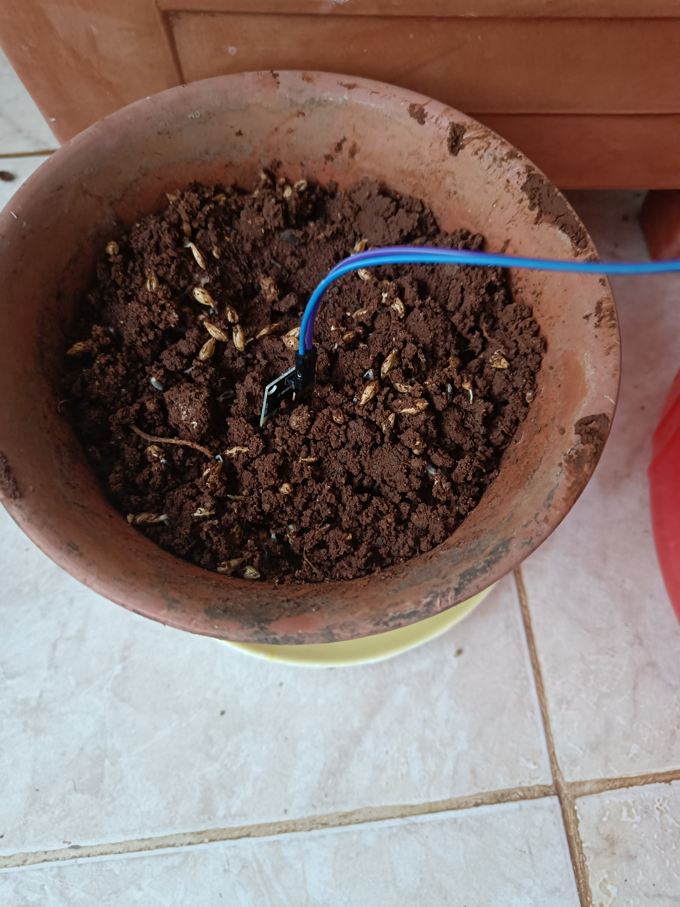
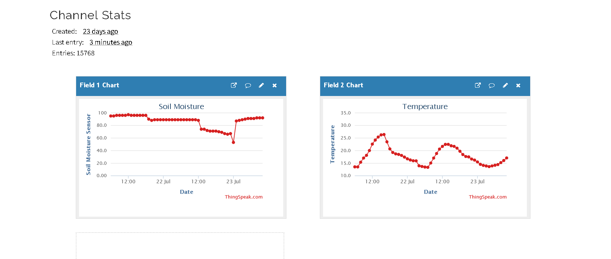

# **🌿 ESP32 Smart Irrigation System**

This is an automated, internet-connected plant watering system built with an ESP32. The system monitors soil moisture and controls a water pump via a relay. It also integrates with the OpenWeatherMap API to check local weather conditions, skipping scheduled watering if it is currently raining. Data is logged to ThingSpeak for remote monitoring.

## **✨ Features**

* 💧 **Automated Watering:** Triggers a water pump based on analog soil moisture readings.  
* 🌦️ **Weather API Integration:** Checks OpenWeatherMap to prevent the pump from running during rain, drizzle, or thunderstorms.  
* 📊 **Cloud Data Logging:** Pushes local soil moisture and outdoor weather data to a ThingSpeak dashboard.  
* 🔋 **Isolated Power:** Uses separate power supplies for the ESP32 and the water pump to ensure system stability.

## **🛠️ Hardware Requirements**

* ESP32 Development Board  
* Analog Soil Moisture Sensor  
* Relay Module (Active-Low)  
* Mini DC Water Pump (5V or 12V depending on your setup)  
* Power supply for ESP32 (e.g., 3x AA battery pack / 4.5V)  
* Separate power supply for the water pump  
* Breadboard and jumper wires  
* Tubing for the pump

## **🔌 Wiring Guide**

| Component | Pin | ESP32 Connection |
| :---- | :---- | :---- |
| **Soil Sensor** | VCC | 3.3V |
|  | GND | GND |
|  | A0 (Data) | GPIO 34 |
| **Relay Module** | VCC | 3.3V (or 5V if required) |
|  | GND | GND |
|  | IN (Signal) | GPIO 5 |

*(Note: The water pump should be wired in series with the normally open (NO) terminals of the relay, powered by its own battery pack).*

## **💻 Software Setup**

1. Install the [Arduino IDE](https://www.arduino.cc/en/software) and add the ESP32 board package in the Board Manager.  
2. Install the ArduinoJson library (by Benoit Blanchon) via the Library Manager.  
3. Open ESP32_ThingSpeak.ino.  
4. Update the configuration variables at the top of the file with your local network and API details:  
   const char* ssid = "YOUR_WIFI_NAME";  
   const char* password = "YOUR_WIFI_PASSWORD";  
   String apiKey = "YOUR_THINGSPEAK_API_KEY";  
   String openWeatherApiKey = "YOUR_OPENWEATHER_API_KEY";  
   String city = "YourCity,CountryCode"; // e.g., "Nairobi,KE"

5. Upload the sketch to your ESP32.

## **⚙️ How It Works**

* The ESP32 fetches local weather data from OpenWeatherMap every 10 minutes.  
* It reads the analog soil moisture sensor and maps the raw value to a percentage (0-100%).  
* If the soil moisture is below the configured dryThreshold (default 30%) and the API does not report rain, the relay turns the pump on.  
* If the weather API reports Rain, Drizzle, or Thunderstorms, the pump remains off to save water, regardless of the soil moisture level.  
* The system pushes the updated sensor and API data to ThingSpeak.

## **🚀 Planned Improvements**

* Re-integrate a DHT11/DHT22 sensor to track local greenhouse temperature and humidity.  
* Implement Deep Sleep functionality to extend battery life.  
* Switch the ESP32 power source to a solar charging circuit.

## **📆 Weekly Plan**

* **Week 1:**
  * Researched all required hardware components, including the ESP32 development board, analog soil moisture sensor, mini DC water pump, and relay module.
  * Hooked up all components on a bench setup to verify functionality. Identified a faulty relay module during initial testing and ordered a replacement.
  * Designed an initial circuit schematic to wire all components together safely.
  
  

* **Week 2:**
  * Attached all components to a breadboard for functional testing and uploaded sample code to read soil moisture data every second and display output.
  * Researched cloud platforms for remote monitoring over Wi-Fi and integrated ThingSpeak to log sensor metrics and generate real-time graphs.

  
  

* **Week 3:**
  * Designed the final code including the OpenWeatherMap weather API integration and thoroughly bench-tested the design before long-term deployment.
  * Mounted and organized the system components inside a protective enclosure box.

  
  

* **Week 4:**
  * Deployed and tested the complete system outdoors over a full week to evaluate system stability, continuous operation, and automated watering accuracy.
  * Set up the water reservoir bucket with the submerged mini pump, routed the flexible watering tube to the potted plant, and embedded the moisture probe in the soil.

  
  
  

* **Week 5:**
  * Evaluated the week-long testing results and made fine-tuning tweaks to the firmware thresholds to ensure optimal soil hydration.
  * Analyzed multi-day telemetry logs on the ThingSpeak dashboard (soil moisture trends and ambient temperature variations) showing over 15,000 recorded entries.
  * Assessed system readiness for scaling up across the entire garden for individual plants once additional components are sourced.

  
  
  
